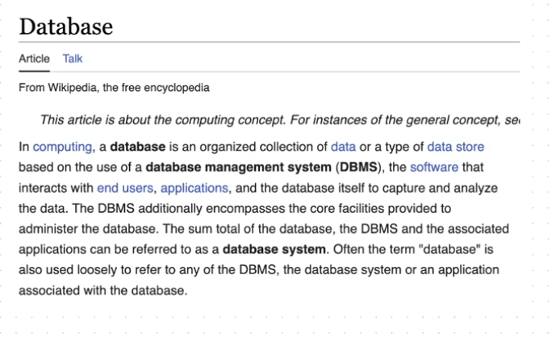
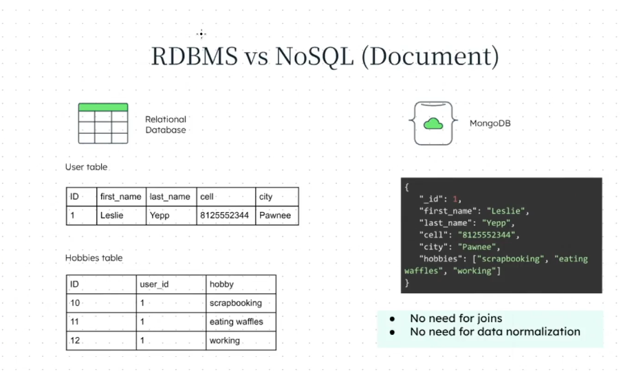

# Databases:
## What is a Database?
- It is an organized collection of data.

## What is a Database Management System?


- The application connects to the DBMS to Connect to the Database.
- DBMS is a layer which is build on the top of the Database.

## Key Concepts
- **ACID Properties**: Atomicity, Consistency, Isolation, Durability. Ensures reliable transactions in databases.
- **CAP Theorem**: Consistency, Availability, Partition Tolerance. No distributed system can guarantee all three at once.
- **Normalization**: Organizing data to reduce redundancy and improve integrity (used in RDBMS).
- **Denormalization**: Increasing redundancy for faster reads (often used in NoSQL).
- **Indexing**: Improves query speed by creating data structures for quick lookups.
- **Transactions**: Group of operations performed as a single unit. Supported in RDBMS and some NoSQL DBs.
- **Replication**: Copying data across multiple servers for high availability and fault tolerance.

## Types of Database:
### 1. Relational DB
  - E.g. MySQL, PostgreSQL
  - **Advantages**: Strong consistency, complex queries, data integrity.
  - **Disadvantages**: Less flexible schema, scaling horizontally is harder.
  - **Use Cases**: Banking, ERP, CRM, e-commerce.

### 2. NoSQL DB
  - E.g. MongoDB
  - **Advantages**: Flexible schema, easy horizontal scaling, handles unstructured data.
  - **Disadvantages**: Weaker consistency, limited complex queries.
  - **Use Cases**: Real-time analytics, IoT, content management, big data.

### 3. Graph DB
  - It is a type of NoSQL Database.
  - E.g. Neo4j
  - **Advantages**: Efficient for complex relationships, fast traversals.
  - **Disadvantages**: Not ideal for tabular data.
  - **Use Cases**: Social networks, fraud detection, recommendation engines.

### 4. In Memory DB
  - It is used in cases where we have an API which is used very frequently. 
  - It uses in Memory Caching, if the cache memory already has all the data then the API call is not made.
  - E.g. Redis.
  - **Advantages**: Extremely fast, ideal for caching and session storage.
  - **Disadvantages**: Data loss risk if not persisted.
  - **Use Cases**: Leaderboards, session management, caching.

### 5. Distributed SQL DB
  - E.g. Cockroach DB
  - **Advantages**: Scalable, ACID compliance, high availability.
  - **Disadvantages**: More complex setup and management.
  - **Use Cases**: Global applications, financial services, SaaS platforms.

### 6. Time Series DB
  - E.g. Influx DB
  - **Advantages**: Optimized for time-stamped data, efficient storage and queries.
  - **Disadvantages**: Limited for non-time-series data.
  - **Use Cases**: IoT, monitoring, financial data, sensor data.

### 7. Object Oriented DB
  - E.g. db4o
  - **Advantages**: Natural mapping to object-oriented languages.
  - **Disadvantages**: Less popular, limited tooling.
  - **Use Cases**: CAD, complex data models, scientific applications.

### 8. Hierarchial DB
  - E.g. IBM IMS(Information Management System)
  - **Advantages**: Simple structure, fast access for hierarchical data.
  - **Disadvantages**: Rigid schema, not flexible for complex relationships.
  - **Use Cases**: Legacy systems, file systems.

### 9. Network DB
  - E.g. IDMS
  - **Advantages**: Supports many-to-many relationships.
  - **Disadvantages**: Complex to design and maintain.
  - **Use Cases**: Telecom, manufacturing, legacy systems.

### 10. Cloud DB
  - E.g. Amazon RDS
  - **Popular Services**: Amazon RDS, Google Cloud SQL, Azure SQL Database, MongoDB Atlas.
  - **Advantages**: Managed service, automatic scaling, backups, high availability.
  - **Disadvantages**: Ongoing cost, less control over infrastructure.
  - **Use Cases**: Web apps, mobile apps, SaaS, global scale apps.

- Organizations often use multiple databases for different needs (polyglot persistence).

## Database Security Best Practices
- Use strong authentication and access controls
- Encrypt data at rest and in transit
- Regularly update and patch DBMS software
- Implement auditing and monitoring
- Backup data frequently and test restores
- Limit network exposure and use firewalls

## Real-World Use Cases
- **E-commerce**: RDBMS for orders, NoSQL for product catalog, Redis for caching
- **Social Media**: Graph DB for relationships, NoSQL for posts, RDBMS for user data
- **IoT**: Time Series DB for sensor data, NoSQL for device metadata
- **Finance**: RDBMS for transactions, Distributed SQL for global scale

## References
- [MongoDB Documentation](https://docs.mongodb.com/)
- [PostgreSQL Documentation](https://www.postgresql.org/docs/)
- [MySQL Documentation](https://dev.mysql.com/doc/)
- [Redis Documentation](https://redis.io/documentation)

## Relational Database Management System(RDBMS) ft. MySQL, PostgreSQL
- SQL stands for Structured Query Language, since this language is used to interact with the database.

- EF Codd defined 13 rules for a database to become a Relational Database.

### 1. SQL
- Modern day databases do not follow these rules but they are still Relational Databases.

- Michael Widenius created the software MySQL named after her daughter My Widenius.

- He created 2 more databases with the name of his daughter i.e. Maria DB and Max DB.

- Maria DB is the fork of My DB.

### 2. PosgreSQL
- Michael Stonebreaker was working on Project Ingres in University of California.

- The project was of SQL so it was called PostgreSQL.

## NoSQL Database ft. MongoDB
- It is also called Not SQL or Not only SQL.
- MongoDB was built in 2009.
- There are several types of NoSQL Databases:
  - `Document DB`
    - MongoDB is a document database.
  
  - `Key Value DB`
  
  - `Graph DB`
  
  - `Wide Column DB`
  
  - `Multi Modal DB`

- 10 gen created MongoDB Software.
- Mongo came from Humongous which means huge or gigantic.
- `10 gen` was renamed to `MongoDB`.
- It is very flexible, very compatible with Javascript.
- It stores data in JSON format.
- Developer's productivity increases with MongoDB.



- In RDBMS we have to do join to get the data from multiple tables.

- In RDBMS the data is stored in the normalized manner i.e. without redundancy.

## Difference between the RDBMS(MySQL) and the NoSQL Databases(MongoDB)
```text
 ___________________________________________________________________________________________
|            RDBMS                               NoSQL                                      |
|___________________________________________________________________________________________|
|   1.  Stores data in terms of          |  1. Stores data in terms of Collection           |
|       Tables, Rows and Columns.        |     document and fields.                         |
|                                        |                                                  |
|   2.  Stores data in structured        |  2. Stores data in unstructured format.          |
|       format.                          |                                                  |
|                                        |                                                  |
|   3. It follows fixed schema it        |  3. It is flexible in terms of the schema.       |
|      cannot be changed easily once     |                                                  |
|      build.                            |                                                  |
|                                        |                                                  |
|   4. It uses the Structured Query      |  4. It uses Mongo Query Language(MQL) to         |
|      Language(SQL) to communicate      |     Communicate with the Database for MongoDB,   |
|      with the Database.                |     or (Cypher) to communicate with the Neq4J.   |
|                                        |                                                  |
|   5. Horizontal Scaling is tough.      |  5. Easy to scale horizontally and vertically.   |
|                                        |                                                  |
|   6. There are ralationships like      |  6. There are nested relationship in the NoSQL   |
|      Foreign Keys and Joins in the     |     databases.                                   |
|      RDBMS.                            |                                                  |
|                                        |                                                  |
|   7. These are used for the Read-heavy |  7. These are used for Real Time, Big Data,      |
|      applications, transactions and    |     distributed computing applications.          |
|      workloads.                        |                                                  |
|                                        |                                                  |
|   8. Examples of the RDBMS applications|  8. Examples of NoSQL Applications are Real Time |
|      are Banking apps.                 |     analytics and social media.                  |
|________________________________________|__________________________________________________|
```

